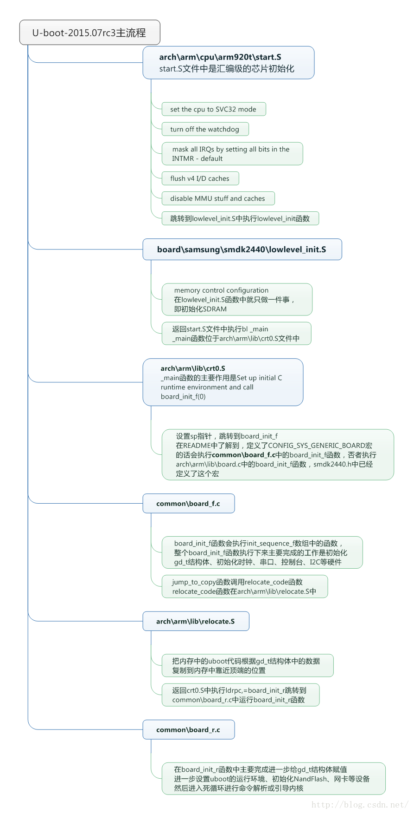

# U-Boot

## 1. 初始化流程


图源见水印

## 2. 板级配置

不同版本阶段的u-boot对单板的配置方式并不一致。较早版本的u-boot是通过根目录下的Makefile来直接对单板进行定义的；从2010.09版本开始板级配置迁移到了boards.cfg文件中;而2014.10版本之后，板级配置文件统一迁移到了configs目录下，板级配置头文件保存在/include/configs路径下。

u-boot的空间划分在crt0.S中的board_init_f完成，在relocate之前对空间进行划分，计算出relocate的位置偏移以及global_data等的偏移，然后对u-boot代码进行了重定向。

添加新的默认环境变量在include/env_default.h中。

添加改动的原则是尽可能的少修改公共文件，相关改动尽可能的放到板级文件中。

使用SPL时希望可以自动生成u-boot-with-spl.bin文件，方便我们烧录，u-boot的Makefile已经做好了这部分工作，我们只需要在板级配置头文件中定义如下两个宏即可

```c
#define CONFIG_SPL_TARGET "u-boot-with-spl.bin"
#define CONFIG_SPL_PAD_TO 0x1000
```

其中，**CONFIG_SPL_TARGET**这个宏定义了合并后的文件名称，如果不使用u-boot-with-spl.bin这个名称的话需要自行在Makefile中添加相应的规则来生成最终的文件。**CONFIG_SPL_PAD_TO**这个宏定义了我们SPL所占的大小，根据实际情况填写就可以。

在mini2440上编译u-boot时，使用codesourcery的arm-2014.05-29-arm-none-linux-gnueabi-i686-pc-linux-gnu.tar.bz2工具链，可以编译成功但是无法正常工作，用led灯定位问题发现问题出在get_PCLK()函数，怀疑问题出在浮点运算部分，上网查证，确实如此，而u-boot也提供了用户私有库，由**CONFIG_USE_PRIVATE_LIBGCC**控制，然后在mini2440_defconfig中添加这一项，u-boot就可以正常运行了:)
