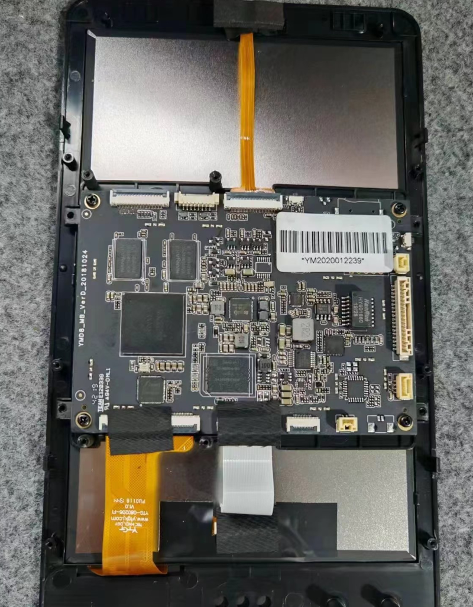
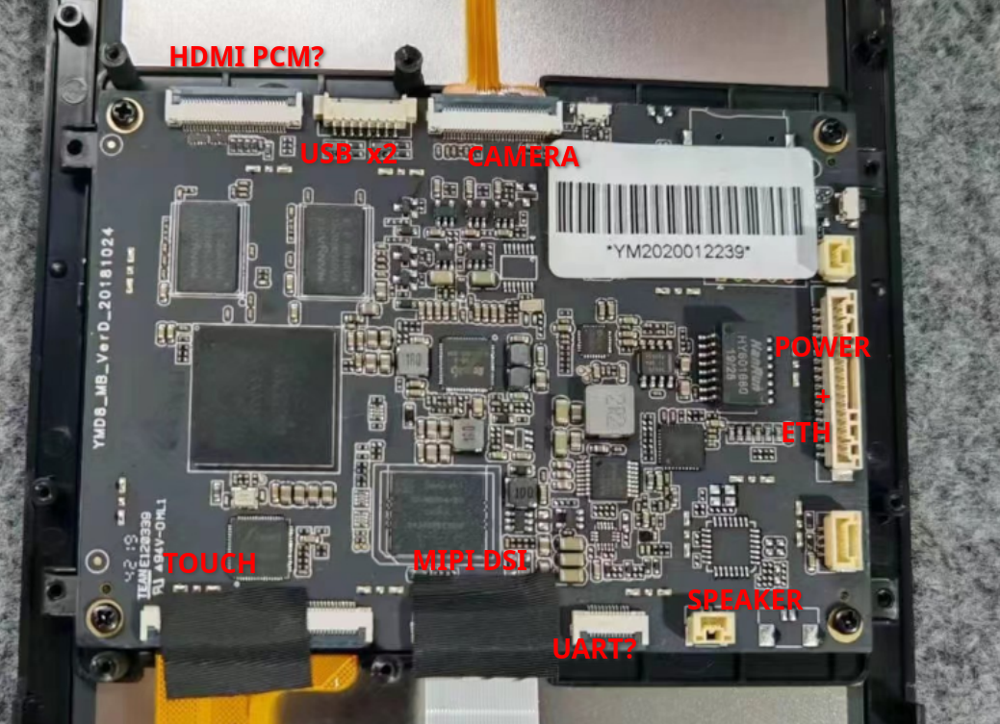
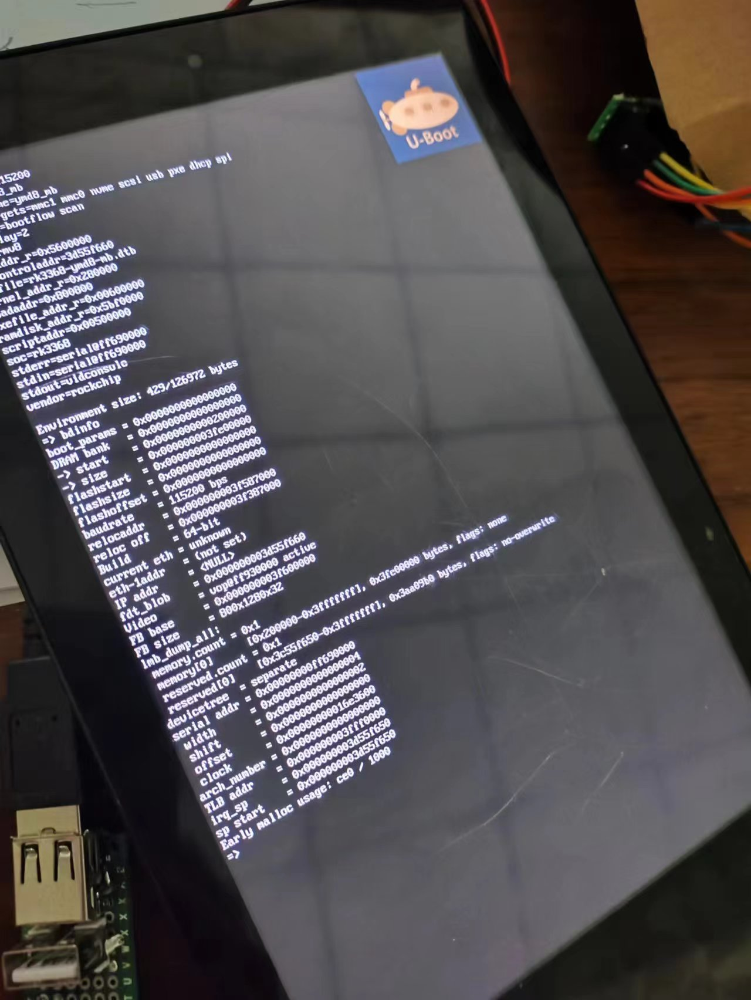

# 二手安卓终端分析定制全流程

## 简介

从咸鱼平台购得一台安卓终端设备，从买家提供的信息可以确定设备的主控为RK3368,剩余信息未知，需要对设备的详细接口信息进行分析。

## 基础信息分析

板卡外观如下



### 供电及各端口连接关系分析

根据电源RK808的走线，逐级向上测量供电来源，最终确认了供电端口以及供电电压。

已经连接设备的端口很容易确认相应的功能，悬空的端口根据布局、外围元器件以及PCB走线方向也基本可以确定其连接关系，目前可以确认的接口如下。



详细的IO顺序(可能有错误)见[这里](YMD8_MB_Adapter.pdf)中的PFC元件部分。

### 系统信息获取及备份

Rockchip平台的调试串口一般情况下使用的是UART2,这组串口的默认复用通常在TF卡的D0与D1引脚，这个安卓终端有TF卡槽位置，但是并未焊接，使用USB转串口连接探针直接连接到D0/D1脚可以观察到有日志输出，随后补焊TF卡槽及相应的0欧电阻后便可以使用0.8mm厚度的TF PCB转接板进行连接了。

系统启动后串口终端可以直接使用`su`命令切换到`root`用户，随后使用U盘或者网络对原机系统进行整体备份(使用dd命令或者相应的网络拷贝命令)，并单独导出boot分区以便导出设备树进行分析。

一般情况下，消费市场的Rockchip平台安卓终端普遍使用的是厂商提供的SDK,因此uboot等镜像均为rk格式的镜像。

导出的boot分区为标准的`Android boot image`，在Linux平台中可以使用`abootimg`工具来对boot.img进行解包，解包后的文件一般包括内核、initramfs以及second stage,这里的second stage文件是rk格式的资源文件，里面一般包含了bmp格式的logo图片以及dtb文件。

```shell
$ ls
boot.bin
$ abootimg -x boot.bin
writing boot image config in bootimg.cfg
extracting kernel in zImage
extracting ramdisk in initrd.img
extracting second stage image in stage2.img
$ ls
boot.bin  bootimg.cfg  initrd.img  stage2.img  zImage
$ /opt/rkbin/tools/resource_tool --unpack --image=stage2.img
Dump header:
partition version:0.0
header size:1
index tbl:
        offset:1        entry size:1    entry num:3
Dump Index table:
entry(0):
        path:rk-kernel.dtb
        offset:4        size:100651
entry(1):
        path:logo.bmp
        offset:201      size:170326
entry(2):
        path:logo_kernel.bmp
        offset:534      size:19160
Unack stage2.img to out successed!
$ ls out
logo.bmp  logo_kernel.bmp  rk-kernel.dtb
```

经过以上步骤，便获取到了该终端设备的设备树，使用`dtc`命令反编译即可得到源文件，通过对源文件进行分析，进一步得到外设及IO的使用分布情况，原始dts文件在[这里](rk3368.dts)。

| 外设 | 模块 |
| :--- | :- |
| I2C0 | RK808 |
| I2C1 | ES8316 |
| I2C2 | gslx680 |
| UART0 | bluetooth |
| EMMC | EMMC |
| SDMMC | TF Card |
| SDIO | WIFI |

| 功能 | IO |
| :--- | :- |
| usb host drv gpio | gpio0, 0x04 |
| usb otg drv gpio | gpio0, 0x05 |
| power key | gpio0, 0x02 |
| lcd rst gpio | gpio0, 0x13 |
| lcd backlight enable | gpio0, 0x19 |
| lcd backlight bright | pwm1: pwm@ff680010 |
| eth reset gpio | gpio3, 0x0c |
| es8316 spk gpio | gpio0, 0x1c |
| es8316 i2c | gpio2, 0x15 |
| es8316 i2c | gpio2, 0x16 |
| gslx680 i2c | gpio3, 0x1f |
| gslx680 i2c | gpio0, 0x09 |
| gslx680 touch | gpio0, 0x0c |
| gslx680 reset | gpio0, 0x0b |
| WIFI,poweren_gpio | gpio3, 4 |
| WIFI,host_wake_irq | gpio3, 6 |
| BT,power_gpio | gpio3, 3 |
| BT,reset_gpio | gpio3, 5 |
| BT,wake_gpio | gpio3, 2 |
| BT,wake_host_irq | gpio3, 7 |
| BT,uart rts gpio | gpio2, 0x1b |

## 主线U-Boot支持

尝试使用主线U-Boot来启动此板卡，调整修复了若干驱动问题，终于能点亮屏幕了，目前只测试了EMMC和屏幕，补丁仓库见[这里](https://github.com/ieiao/u-boot/tree/ymd8_mb)。



待续...
