# GSL3680触摸IC固件提取

## 1 序

我们经常可以在二手市场中看到一些极具性价比的安卓终端设备或者板卡，如果可以找到完整资料的话，凭着完整的外设、低廉的价格，这些设备无疑是学生和工程师人群学习与开发实践的最佳选择。

遗憾的是，通常情况下我们都很难找到这些设备的制造商信息，而进一步获取详细的原理图和源代码支持就更具有挑战性了。

为了实现这些二手设备的利用，我们往往需要一些简单的逆向手段，这篇文章介绍了从设备原始内核提取中提取`GSL3680`触摸芯片固件并将其应用到自定义内核中的方法，供大家参考。

## 2 目标设备

我们的目标设备是一款从咸鱼购买的安卓终端设备，SOC型号为RK3368,来自于瑞芯微，原始系统为Android 7,设备外观如下。

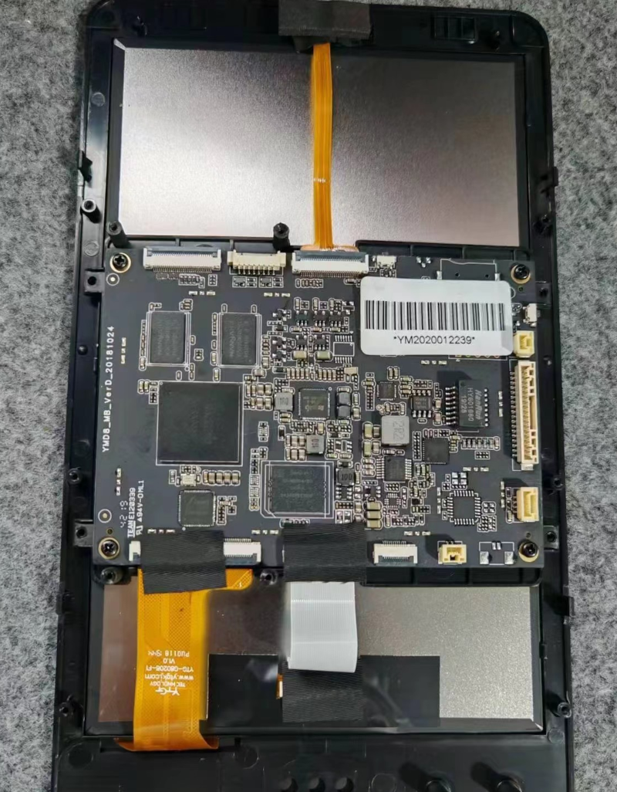

触摸芯片型号如下。

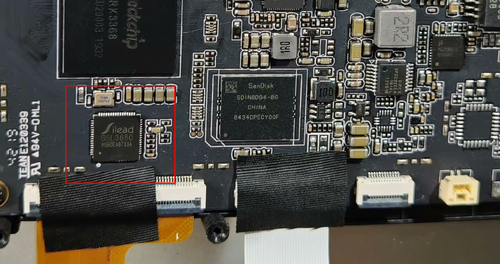

在提取触摸芯片固件之前，我们需要确认触摸芯片的驱动是作为单独的模块存在的还是被编译到了内核中,这里我们以这个板卡为例，通过分析启动日志以及系统镜像可以确认它的触摸芯片驱动是编译到了内核中的。

接下来便需要从设备中提取出原始系统使用的Linux内核，这一步根据厂商和系统版本不同会有差异，这里暂不展开。

好了，假设你已经成功的提取到了内核，接下来便可以尝试提取了。

## 3 提取方法

### 3.1 源码获取

为了提取固件，我们首先需要确认驱动当中的固件格式。一般来说，制造商会使用和原厂相同或者类似型号的外围元器件以便降低开发成本并加快开发进度，所以我们可以从原厂SDK中查找固件格式的线索。

经过检索，我们找到了[FriendlyELEC](http://friendlyelec.com/)开源的RK3399板卡的[安卓SDK](https://gitlab.com/friendlyelec/rk3399-android-10/)，这个SDK中不仅包含该触摸IC的驱动源码，还提供RK3368平台的支持，方便我们后续进一步验证所提取的固件的正确性。

### 3.2 固件格式分析

要想从Linux二进制文件中提取`GSL3680`固件，我们需要确认它的固件在二进制形式下的分布排列格式，这里我们直接对上一小节中获取到的SDK中的驱动源码展开分析，这里以[kernel/drivers/input/touchscreen/gslx680_pad.h](https://gitlab.com/friendlyelec/rk3399-android-10/-/blob/main/kernel/drivers/input/touchscreen/gslx680_pad.h?ref_type=heads)为例，几个关键数据内容如下。

```c
struct fw_data
{
    u32 offset : 8;
    u32 : 0;
    u32 val;
};

static unsigned int gsl_config_data_id[] =
{
    0x8a44e0,  
    0x200,
    0,0,
    0,
    0,0,0,
    0,0,0,0,0,0,0,0xd4bc5deb,
    /* ... */
    0x10203,0x4050607,0x8090a0b,0xc0d0e0f,0x10111213,0x14151617,0x18191a1b,0x1c1d1e1f,
    0x20212223,0x24252627,0x28292a2b,0x2c2d2e2f,0x30313233,0x34353637,0x38393a3b,0x3c3d3e3f,
    /* ... */
};

static struct fw_data GSLX680_FW[] = {

{0xf0,0x2},
{0x00,0x00000000},
{0x04,0x00000000},
{0x08,0x00000000},
{0x0c,0x00000000},
{0x10,0x00000000},
/* ... */
{0x74,0x00000000},
{0x78,0x31343a35},
{0x7c,0x323a3230},
};
```

可以看到，`GSL3680`的固件信息包括两部分，分别是配置数据`gsl_config_data_id`和固件数据`GSLX680_FW`,这里我们先从固件数据入手，因为从它的结构体定义以及结构体自然对齐的原则推测，这个巨大的结构体数组在最终的二进制文件中大概率是8字节对齐的，而且它的内容具有规律性，始终是以`0x000000f0`+`地址偏移`作为数据头，而数据又是以`0x0000007c`+`数据内容`
结束的，很容易被检索到。

对于配置数据部分，我们可以很容易的确认他在最终的二进制文件中一定是4字节对齐的，它的长度为`2048`字节，并且第二个成员一定是`0x00000200`，此外数据中还包含规律的`0x30313233`内容，并且大概率位于固件数据前面的位置。

### 3.3 固件提取

在确认固件的格式之后便可以进行提取了，这里我们首先使用`hexdump`查找确认固件位置，使用`dd`导出固件，使用`hexdump`命令打开内核文件。

```shell
$ hexdump -C zImage | less
```

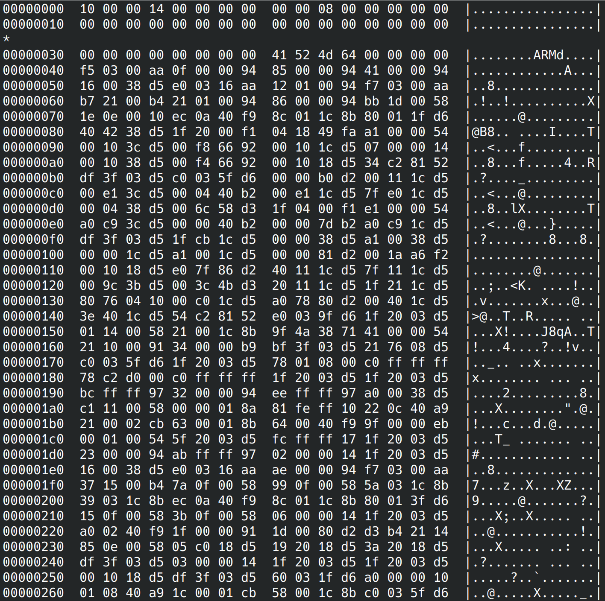

> 注意这里的zImage并不是压缩内核，只是文件为zImage,从文件头可以看出这一点。

接下来我们使用上一小节确认的固件数据数据头格式

```
  f0 00 00 00 02 00 00 00
```

作为关键字进行搜索，注意这里字符串开始为两个空格。

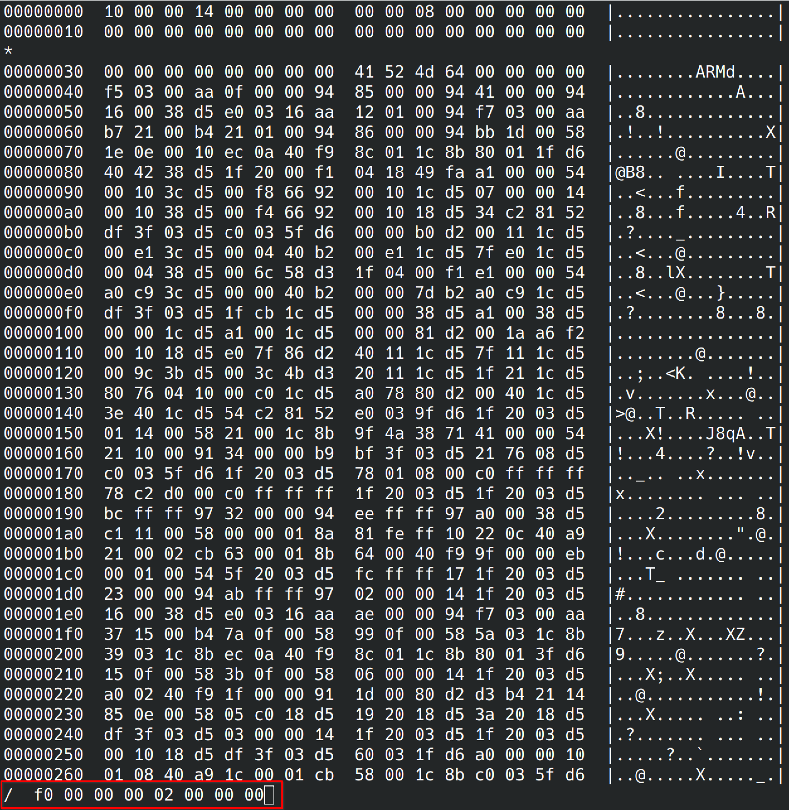

对搜索结果的上下文进行分析，发现和固件数据完全吻合，这里我们可以看到规律的数据段结束和下一段的开头，记下这个偏移地址`0x00db50a8`。

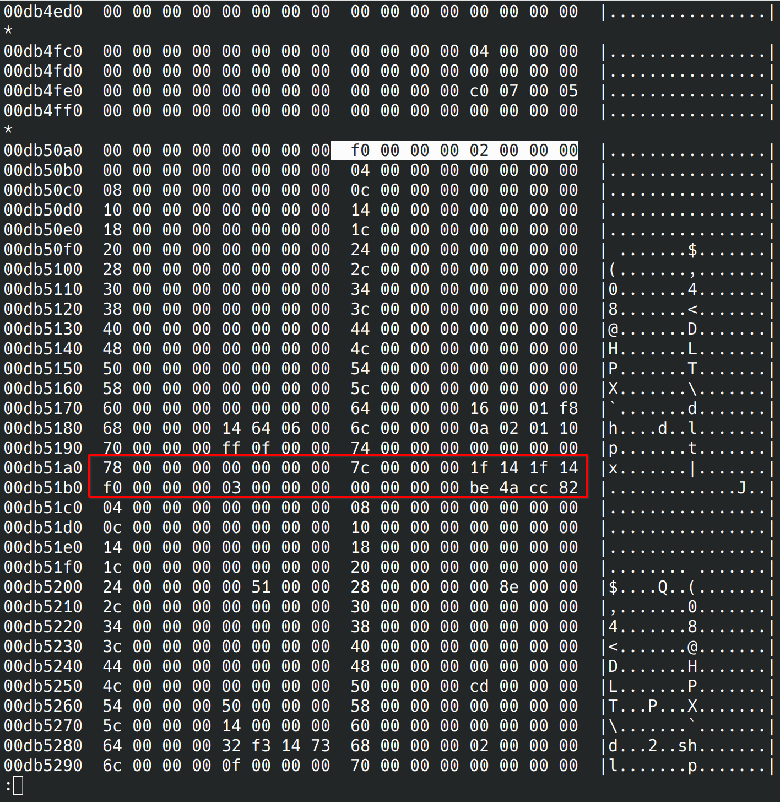

接下来我们按下`G`跳转到文件末尾进行倒序搜索以便确认数据段结束位置，这里的`?`即为倒序搜索命令。

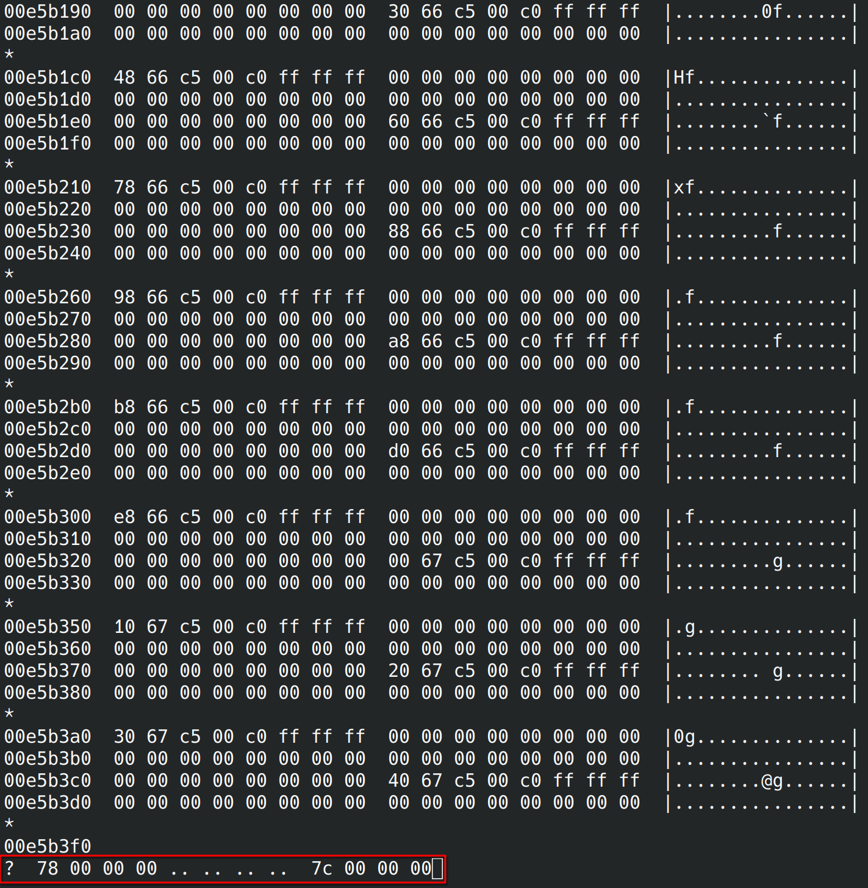

首次检索便得到了我们预期的内容，这里还看到了驱动中的字符串内容`gslX680`，同样记下数据段结束偏移地址`0x00dbe210`。

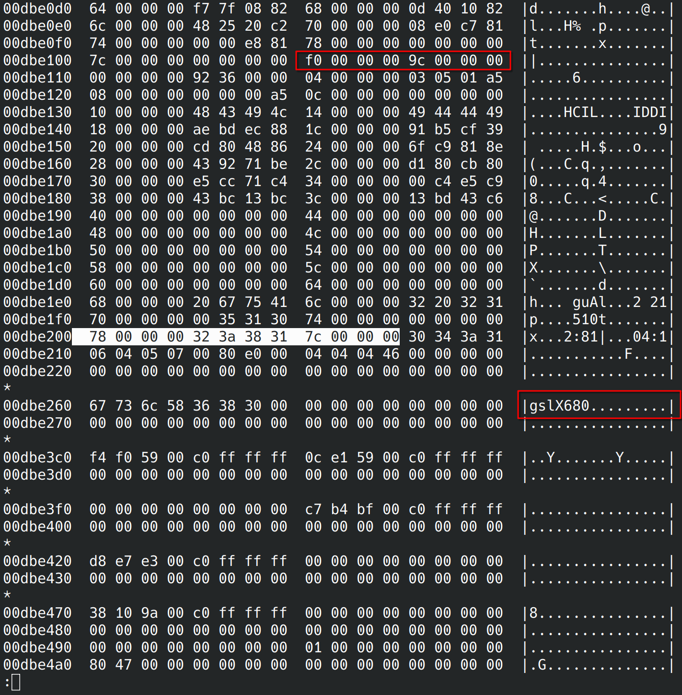

到这里我们已经确认了固件数据部分的起始编译地址`0x00db50a8`和结束编译地址`0x00dbe210`，长度也很容易进行计算，我们将他们转换为10进制，这里只需要起始偏移和数据长度即可。

```
起始偏移: 14373032
数据长度: 37224
```

接下来我们使用`dd`命令将数据进行导出便成功获取到了`GSL3680`的固件数据部分。

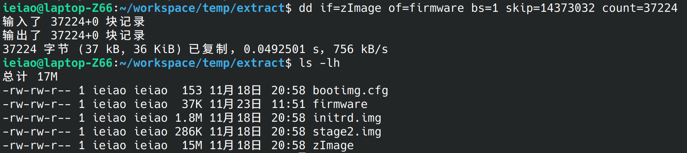

回到`hexdump`中我们已经确认的固件数据偏移处，尝试倒序搜索上一小节确认的配置数据第二个成员`0x00000200`。

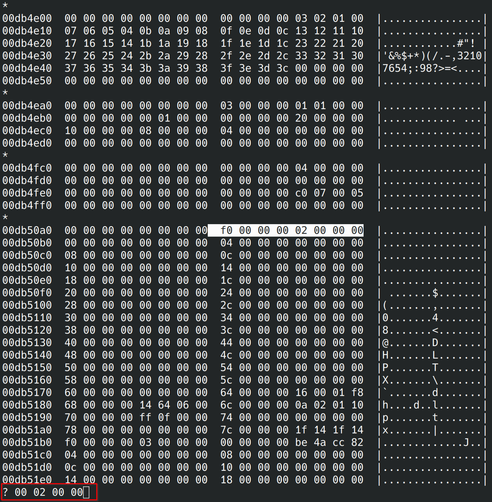

很容易便检索到了这个成员，其他数据格式也和配置数据部分吻合，记下这个偏移地址`0x00db48a8`。

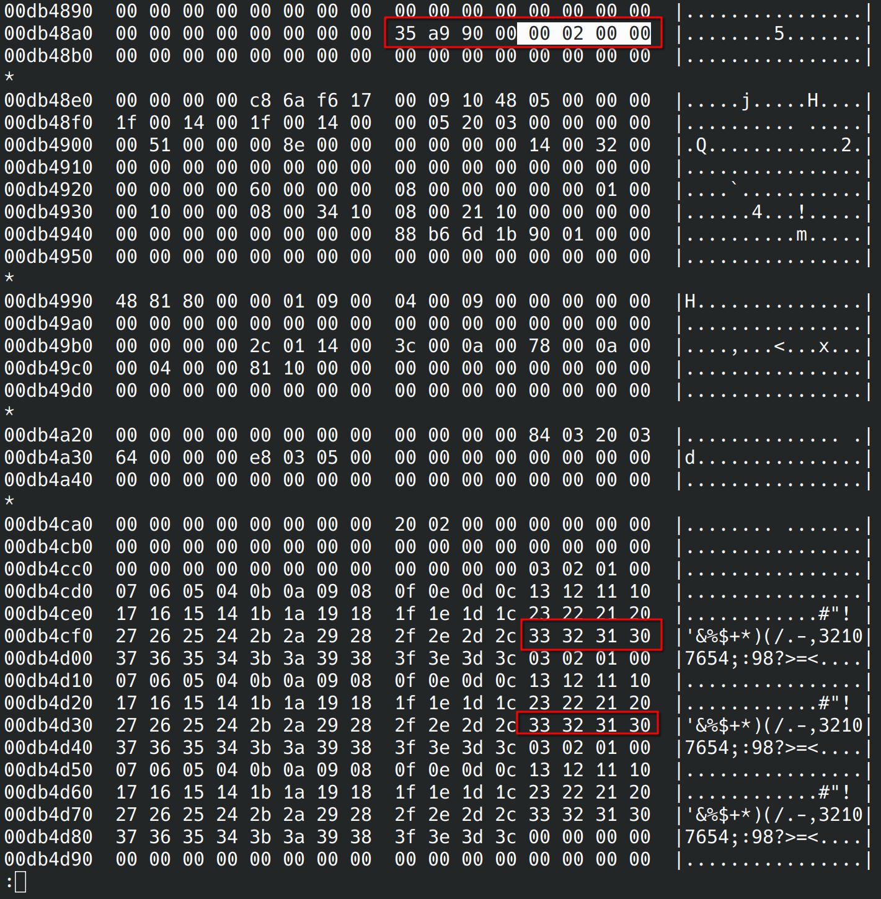

同样使用`dd`命令导出数据。

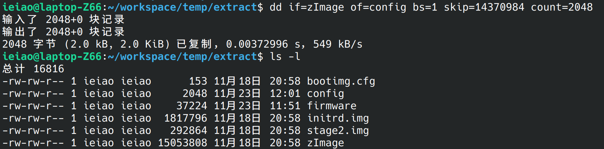

### 3.4 格式转换

好了，我们已经成功的提取了需要的固件了，接下来需要把他们转换为源码使用的数组格式，这里同样可以使用`hexdump`工具来完成，`hexdump`工具提供了自定义格式化输出的功能，可以很方便的将二进制文件转换为我们想要的数组格式。

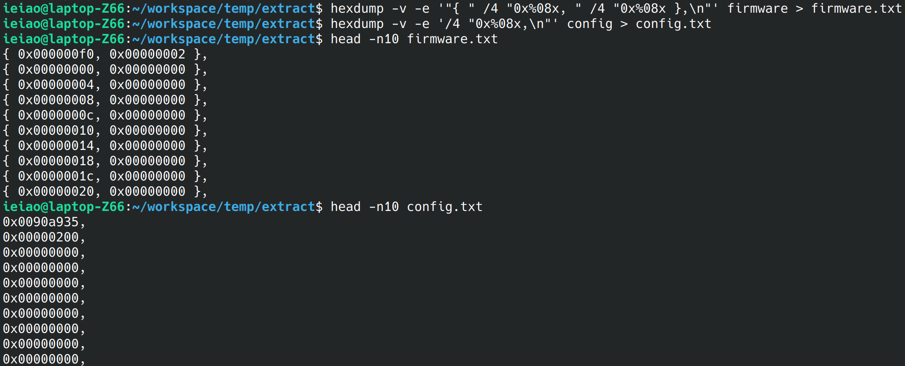

## 4 驱动验证

使用提取到的固件替换驱动中原有的固件，修改AOSP代码适配此板卡，最终触摸屏可以正常使用。
